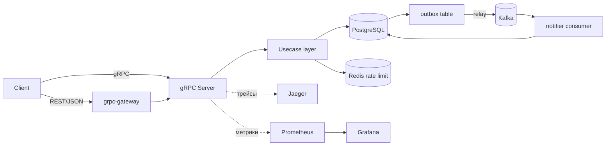

# T-Wallet

Бэкенд электронного кошелька на Go: регистрация пользователей, счета и переводы денег между ними. Домен «деньги» выбран специально — он заставляет решать те же задачи, что и в реальном финтехе: консистентность, идемпотентность, надёжная доставка событий.

Внешний API — gRPC с REST-обёрткой через grpc-gateway (одно описание `.proto` — два протокола).

## Стек

Go 1.25 · PostgreSQL (pgx v5) · gRPC + grpc-gateway · Kafka · Redis · JWT (HS256) · bcrypt · Prometheus · OpenTelemetry + Jaeger · Grafana · Docker Compose · Kubernetes (kind).

## Архитектура

Два независимых сервиса, общающихся асинхронно через Kafka:

- **`wallet`** — основной сервис: аутентификация, счета, переводы, gRPC/REST API, публикация событий через transactional outbox.
- **`notifier`** — сервис-консьюмер: читает события из Kafka и создаёт уведомления идемпотентно.



Зависимости направлены внутрь: `transport → usecase → repository`. Транспорт (gRPC/HTTP) ничего не знает о SQL, бизнес-логика оперирует интерфейсами репозиториев — за счёт этого её можно юнит-тестировать с моками без базы.

## Возможности

- Регистрация (email + пароль, хранится только bcrypt-хеш), логин с выдачей JWT.
- Счета в валюте (для MVP — RUB), баланс не может уйти в минус.
- Операции: пополнение, списание, атомарный перевод между счетами.
- Идемпотентность каждой денежной операции по ключу `Idempotency-Key`.
- Баланс и история операций.
- Публикация события после каждой успешной операции и асинхронная обработка отдельным сервисом.
- Health-check (`/healthz`, `/readyz`), метрики Prometheus (`/metrics`), rate limiting на денежные операции, graceful shutdown.

## Технические решения

Самая ценная часть — не что сделано, а почему.

**Деньги — целые числа (копейки), не `float`.** Хранение денег во `float`/`double` теряет копейки на округлении. Всё в `BIGINT` в минимальных единицах, плюс на уровне БД стоит `CHECK (balance >= 0)` как последний рубеж защиты от отрицательного баланса.

**Double-entry ledger.** Каждая операция пишет проводки в `ledger_entries` (журнал для истории и аудита), при этом баланс для скорости хранится и в колонке `accounts.balance`, обновляемой в той же транзакции. Это осознанный компромисс: быстрый расчёт баланса + честный журнал.

**Атомарность и защита от гонок.** Перевод — одна БД-транзакция. Оба счёта блокируются через `SELECT ... FOR UPDATE`, причём **в детерминированном порядке по возрастанию `id`** — иначе встречные переводы A→B и B→A могут поймать дедлок. Корректность проверена concurrency-тестом на 100 параллельных переводов.

**Идемпотентность.** Ключ запроса «застолбляется» первым в транзакции через `INSERT ... ON CONFLICT (key) DO NOTHING`. При конкурентной гонке двух одинаковых запросов второй под уровнем изоляции Read Committed блокируется до коммита первого и затем видит уже готовый результат — повторное списание невозможно. Дополнительно хранится хеш тела запроса: тот же ключ с другим телом — это ошибка клиента (конфликт), а не тихий повтор.

**Transactional outbox.** Нельзя атомарно «записать в БД И отправить в Kafka». Поэтому событие пишется в таблицу `outbox` в той же транзакции, что и деньги, а отдельная relay-горутина публикует его в Kafka и помечает `published=true` только после подтверждённого ack. Гарантия — at-least-once: событие может уйти дважды при сбое, поэтому консьюмер идемпотентен (по `transaction_id`).

## Структура репозитория

```
├── api/proto/            # .proto + сгенерированный код (gRPC, gateway, swagger)
├── cmd/
│   ├── wallet/           # основной сервис
│   └── notifier/         # сервис-консьюмер
├── domain/               # доменные сущности и ошибки
├── internal/
│   ├── config/           # конфигурация из env (12-factor)
│   ├── auth/             # JWT, контекст пользователя
│   ├── usecase/          # бизнес-логика (интерфейсы репозиториев здесь)
│   ├── repository/postgres/  # реализация на pgx
│   ├── ratelimit/        # rate limiter на Redis
│   ├── kafka/            # producer (outbox relay) + consumer
│   ├── transport/grpc/   # gRPC-хендлеры, интерсепторы (auth, metrics, rate limit)
│   ├── transport/http/   # grpc-gateway, health, metrics
│   └── observability/    # логгер, метрики, трейсер
├── migrations/           # SQL-миграции (golang-migrate)
├── deployments/
│   ├── docker-compose.yml
│   └── k8s/              # манифесты Kubernetes
├── observability/        # конфиги Prometheus / Grafana
├── .gitlab-ci.yml
├── Dockerfile            # multi-stage, distroless
└── Makefile
```

## Запуск локально

Требования: Docker, Go 1.25+, `protoc` в PATH, CLI `migrate` (golang-migrate).

```bash
cp .env.example .env      # заполнить секреты
make up                   # поднять Postgres, Kafka, Redis, Jaeger, Prometheus, Grafana
make migrate-up           # применить миграции
make run                  # запустить сервис wallet
go run ./cmd/notifier     # в отдельном терминале — консьюмер
```

По умолчанию:

- gRPC — `localhost:50051`
- REST — `http://localhost:8080`
- Jaeger UI — `http://localhost:16686`
- Grafana — `http://localhost:3000` (admin/admin)

Регенерация кода из `.proto`:

```bash
make proto
```

## Примеры запросов (REST)

Все денежные операции требуют заголовок `Idempotency-Key` (UUID). Все методы, кроме `Register` и `Login`, требуют `Authorization: Bearer <JWT>`.

```bash
# регистрация
curl -X POST http://localhost:8080/v1/auth/register \
  -H "Content-Type: application/json" \
  -d '{"email":"alice@example.com","password":"secret123"}'

# логин -> access_token
curl -X POST http://localhost:8080/v1/auth/login \
  -H "Content-Type: application/json" \
  -d '{"email":"alice@example.com","password":"secret123"}'

# создать счёт
curl -X POST http://localhost:8080/v1/accounts \
  -H "Authorization: Bearer $TOKEN" -H "Content-Type: application/json" \
  -d '{"currency":"RUB"}'

# пополнение
curl -X POST http://localhost:8080/v1/accounts/$ACC/deposit \
  -H "Authorization: Bearer $TOKEN" -H "Idempotency-Key: $(uuidgen)" \
  -H "Content-Type: application/json" -d '{"amount": 10000}'

# баланс
curl http://localhost:8080/v1/accounts/$ACC/balance \
  -H "Authorization: Bearer $TOKEN"

# перевод
curl -X POST http://localhost:8080/v1/transfers \
  -H "Authorization: Bearer $TOKEN" -H "Idempotency-Key: $(uuidgen)" \
  -H "Content-Type: application/json" \
  -d '{"from_account_id":"'$ACC'","to_account_id":"'$OTHER'","amount":500}'
```

gRPC (reflection включён, `.proto` клиенту не нужен):

```bash
grpcurl -plaintext -H "authorization: Bearer $TOKEN" -H "idempotency-key: $(uuidgen)" \
  -d "{\"account_id\":\"$ACC\",\"amount\":10000}" \
  localhost:50051 wallet.v1.WalletService/Deposit
```

## Маппинг ошибок

Доменные ошибки транслируются в коды gRPC, а grpc-gateway — в HTTP-статусы по стандартной таблице:

| Ситуация | gRPC | HTTP |
|---|---|---|
| Валидация (amount ≤ 0, from == to, нет `Idempotency-Key`) | `InvalidArgument` | 400 |
| Нет токена / токен невалиден | `Unauthenticated` | 401 |
| Чужой счёт | `PermissionDenied` | 403 |
| Счёт/пользователь не найден | `NotFound` | 404 |
| Email занят / повтор ключа с другим телом | `AlreadyExists` | 409 |
| Недостаточно средств | `FailedPrecondition` | 400 |
| Превышен rate limit | `ResourceExhausted` | 429 |

## Тестирование

```bash
make test              # unit-тесты бизнес-логики (моки репозиториев)
make test-integration  # интеграционные тесты на реальном Postgres (testcontainers)
```

Покрытие:

- **Unit** — бизнес-правила usecase с моками репозиториев.
- **Integration** — реальный Postgres в контейнере через testcontainers-go.
- **Concurrency** — 100 параллельных переводов с проверкой, что баланс сходится ровно и не уходит в минус (доказательство корректности блокировок).
- **Идемпотентность** — конкурентные запросы с одним ключом не создают двойного списания; повторная доставка события консьюмеру не создаёт второго уведомления.

## Наблюдаемость

- Структурные логи (`log/slog`, JSON) с `trace_id` в каждой записи — прямой переход из лога в трейс.
- Метрики Prometheus: количество запросов по методам и кодам, латентность (histogram), лаг outbox.
- Распределённый трейсинг через OpenTelemetry → OTLP → Jaeger: один trace проходит `gateway → gRPC → usecase → Postgres`.
- Grafana с автоматически подключённым источником данных.

## Kubernetes (опционально)

Манифесты в `deployments/k8s/` демонстрируют Deployment / Service / ConfigMap / Secret и три вида проб (liveness / readiness / startup). Инфраструктурные зависимости (Postgres/Kafka/Redis) в кластер сознательно не включены — в проде это managed-сервисы или отдельные Helm-чарты. Секреты не коммитятся в git, а создаются через `kubectl create secret`.

```bash
kubectl create secret generic t-wallet-secrets \
  --from-literal=POSTGRES_USER=... \
  --from-literal=POSTGRES_PASSWORD=... \
  --from-literal=JWT_SECRET=...
kubectl apply -k deployments/k8s/
```

## Что осознанно упрощено

- Одна валюта (RUB) вместо мультивалютности и конвертации.
- Баланс дублируется в колонке `accounts.balance` ради скорости, а не считается каждый раз суммой проводок.
- Общая БД на оба сервиса — это шаг к микросервисной архитектуре, а не эталонная изоляция данных на сервис.
- Refresh-токены не реализованы (только access-токен).

## Лицензия

Учебный pet-проект.